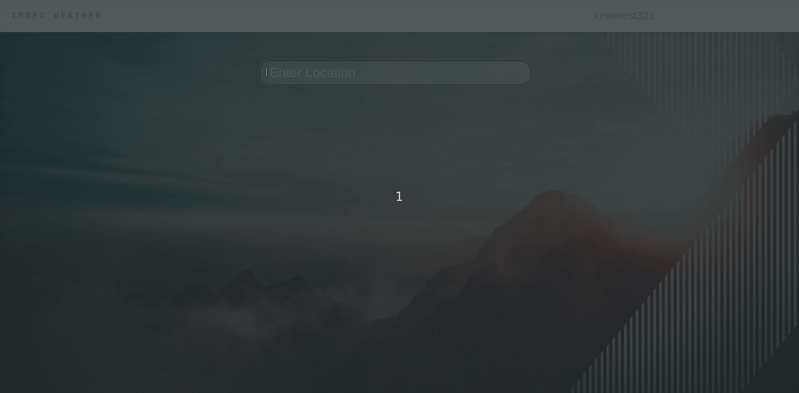
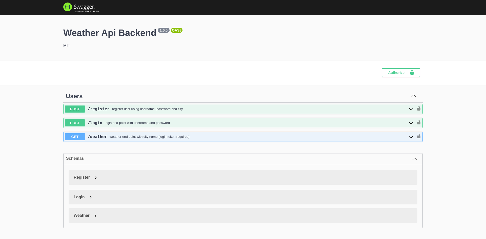
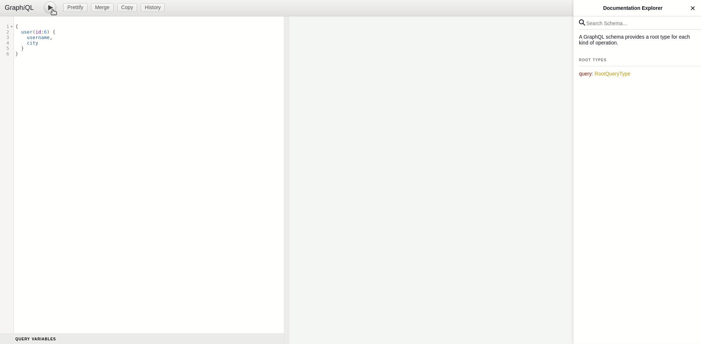

# Imdex Weather

Imdex Weather is a single-page weather app built with React and ExpressJS.
## Live Demos

[React Client Demo](http://ec2-50-18-229-167.us-west-1.compute.amazonaws.com/)

[GraphQL Demo](http://ec2-50-18-229-167.us-west-1.compute.amazonaws.com/backend/graphql)

[Swagger API Documentation](http://ec2-50-18-229-167.us-west-1.compute.amazonaws.com/backend/api-docs)





## Description
Using the **<a href="https://openweathermap.org/api">OpenWeather API</a>**, the Imdex Weather app allows users to search over 200,000 cities to see what the weather is like for the city being searched. Users can view details such as the Temperature, Humidity, and Description of the weather (Sunny, Cloudy, Rain, etc.)

## Getting Started

### Dependencies

* Node ^14.19.2
* React ^17.0.0
* ExpressJS ^4.18.1
* Axios ^0.27.2
* PostgreSQL ^8.7.3

### OpenWeather API Key

1. Create an <code> .env </code> in the **/backend** directory where you'll be providing the required API key. 

2. Obtain the Current Weather API key from **<a href="https://openweathermap.org/api">OpenWeather API</a>**. Place the API key in the ```.env ``` file you created in the backend. 

<br>  

### Backend Setup
1. Open your terminal and install all backend dependencies while in the main **/backend** directory.

```
npm install
```

2. Run psql as postgres user

```
psql --u postgres
```

3. Once psql is launched, create a Database named **imdex**, then switch to the imdex database.
```
postgres=# CREATE DATABASE imdex;
postgres=# /c imdex;
```

4. Insert Users Database schema
```
imdex=# \i db/schema/01_users.sql
```

5. Open your terminal and navigate to your **/backend** folder then run the server.  
```
npm start
```

6. To access the Swagger API Docs, visit this url.
```
http://localhost:3001/api-docs/  
```  



7. To access the GraphQL interface, visit this url.

```
http://localhost:3001/graphql
```
ex. query, returns user username, and city.
```
{
  user(id:6) {
    username,
    city
  }
}
```


<br>  

### Frontend Setup  
1. Install all frontend dependencies while in the main **/frontend** directory.
```
npm install
```


2. Launch the frontend client.
```
npm start
```

5. Lastly, visit the website on your localhost and start searching cities.
```
http://localhost:3000/
```

## Authors

[Kevin Phan](https://www.linkedin.com/in/kevinphan15/)

## Version History

* 0.2
    * Setup JWT Auth / Users model
    * See [commit change]() or See [release history]()
* 0.1
    * Initial Release without JWT Auth / Users

## License

This project is licensed under the MIT License - see the LICENSE.md file for details
